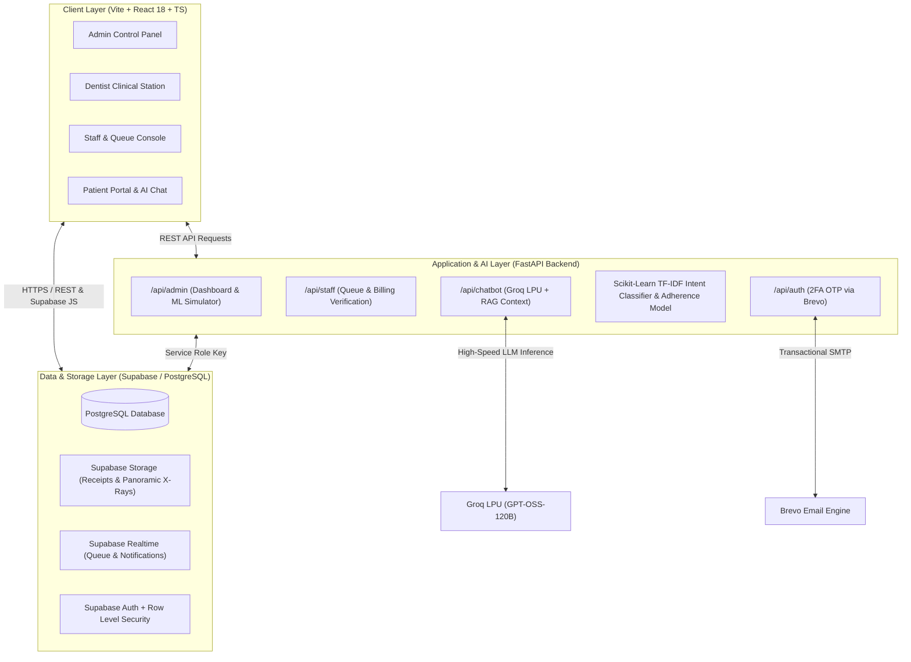

# TeethTalk DAMS — Dental Appointment & Treatment Monitoring System with AI-Powered Conversational Assistant

[](https://reactjs.org/)
[](https://vitejs.dev/)
[](https://www.typescriptlang.org/)
[](https://tailwindcss.com/)
[](https://fastapi.tiangolo.com/)
[](https://www.python.org/)
[](https://supabase.com/)
[](https://groq.com/)
[](https://scikit-learn.org/)

An enterprise-grade, multi-branch dental clinic management platform developed for **TeethTalk Dental Clinic** (Pasig City, Fairview, and San Juan branches). The system combines clinical dental monitoring (FDI 2-digit odontogram charting, step-by-step treatment workflows, adherence risk monitoring) with an ultra-low-latency AI triage conversational assistant powered by **Groq LPU** and **Scikit-Learn NLP Machine Learning models**.

---

## Table of Contents
1. [System Architecture & Data Flow](#system-architecture--data-flow)
2. [Key Portals & Features](#key-portals--features)
3. [AI & Machine Learning Engine](#ai--machine-learning-engine)
4. [Tech Stack](#tech-stack)
5. [Database Schema](#database-schema)
6. [Local Development Setup](#local-development-setup)
7. [Production Deployment Guide](#production-deployment-guide)
8. [Environment Variables Reference](#environment-variables-reference)
9. [API Documentation](#api-documentation)
10. [Authors & Acknowledgments](#authors--acknowledgments)
11. [License](#license)

---

## System Architecture & Data Flow



---

## Key Portals & Features

### 1. 🛡️ Admin Management & Analytics Portal (`/admin`)
- **Multi-Branch Overview**: Real-time operational overview with instantaneous branch-level filtering across **Pasig**, **Fairview**, and **San Juan** branches.
- **Interactive Telemetry Grid**: Tracks active patients today, AI conversational volume, pending financial clearances, and clinical adherence risk rates.
- **Machine Learning Intent Simulator**: Live administrative tool to test real-time Scikit-Learn TF-IDF text classification with confidence scores, predicted risk levels, and Groq triage response previews.
- **Dynamic AI Hyperparameter Calibration**: Allows clinic administrators to adjust Groq LLM temperature and customize clinic triage prompt instructions in real-time without redeploying code.
- **System Audit Trail**: Complete immutable operational logs tracking authentication, queue movements, payment verifications, and clinical adherence reminder dispatches.

### 2. 👨‍⚕️ Dentist Clinical Station (`/dentist`)
- **Interactive FDI Odontogram**: Digital tooth charting covering adult permanent teeth (11–48) and pediatric primary teeth (51–85) with surface-specific condition tags (Sound, Carious, Missing, Restored, For Extraction).
- **Step-by-Step Procedure Tracking**: Real-time logging of multi-phase clinical procedures (e.g., Orthodontic bracket placement, Root canal cleaning, Obturation).
- **Automated Prescription Dispatch**: Medical script generation with automatic dosage scheduling (`"every 8 hours"` $\rightarrow$ scheduled medication reminders).
- **Dentist Availability Toggle**: Real-time doctor active/offline status synced directly to front desk queue routers.

### 3. 🏥 Staff Reception & Queue Console (`/staff`)
- **Live Walk-in & Booking Queue**: Drag-and-drop queue management transitioning patients between *Waiting*, *Active Treatment*, and *Completed*.
- **Comprehensive Billing Management**:
  - **In-Clinic Direct Checkout**: Instant acceptance of Cash, POS Card terminal, or counter GCash payments.
  - **Online Payment Verification**: Review and one-click verification of patient-uploaded GCash/Maya transfer receipts.
- **Patient Directory & Registration**: Quick onboarding with medical history checklists and emergency contact details.

### 4. 🧑‍💼 Patient Care & Adherence Portal (`/patient`)
- **24/7 AI Triage Assistant**: Conversational dental chatbot with dynamic clinic context injection (available doctors, branches, procedure price lists, and scheduled appointments).
- **Pre-approved Installment Submissions**: Centralized GCash / Maya QR scanning and transaction screenshot upload for ongoing orthodontic and prosthetic installment plans.
- **Prescription & Medication Tracking**: Automated alert feed notifying patients of scheduled daily antibiotic, analgesic, and antiseptic mouthwash schedules.
- **Interactive Dental History**: View past treatments, clinical notes, and interactive tooth chart history.

---

## AI & Machine Learning Engine

```
                               ┌─────────────────────────────┐
                               │     Patient Query Input     │
                               └──────────────┬──────────────┘
                                              │
                     ┌────────────────────────┴────────────────────────┐
                     ▼                                                 ▼
      ┌─────────────────────────────┐                   ┌─────────────────────────────┐
      │   TF-IDF Vectorizer Matrix  │                   │ Supabase Dynamic Context    │
      │  (tfidf_vectorizer.joblib)  │                   │ (Doctors, Prices, Schedules)│
      └──────────────┬──────────────┘                   └──────────────┬──────────────┘
                     ▼                                                 │
      ┌─────────────────────────────┐                                  │
      │  Multinomial Logistic       │                                  │
      │  Regression Classifier      │                                  │
      │  (best_intent_model.joblib) │                                  │
      └──────────────┬──────────────┘                                  │
                     ▼                                                 │
      ┌─────────────────────────────┐                                  │
      │ Intent: appointments /      │                                  │
      │ billing / post_op_care /    │                                  │
      │ general_inquiry + Risk Tier │                                  │
      └──────────────┬──────────────┘                                  │
                     └────────────────────────┬────────────────────────┘
                                              ▼
                               ┌─────────────────────────────┐
                               │  Groq LPU Inference Engine  │
                               │  (Dynamic Temp & Prompt)    │
                               └──────────────┬──────────────┘
                                              ▼
                               ┌─────────────────────────────┐
                               │ Safe, Contextual Dental     │
                               │ Triage Response + Action    │
                               └─────────────────────────────┘
```

1. **Intent Classification NLP**: Scikit-Learn TF-IDF vectorizer + Logistic Regression model trained on clinical conversational datasets across 4 core intents (`appointments`, `billing`, `general_inquiry`, `post_op_care`).
2. **Clinical Adherence Risk Model**: Supervised ML model (`best_adherence_model.joblib`) calculating patient default probability based on visit gaps, missed medication alerts, and symptom reports.
3. **Groq LPU High-Speed LLM**: Sub-second conversational responses with context injection from the clinic's live database.

---

## Tech Stack

| Layer | Technology | Description |
| :--- | :--- | :--- |
| **Frontend Framework** | **React 18 (Vite)** | Ultra-fast client build environment |
| **Language** | **TypeScript / JavaScript (ESNext)** | Full type safety and modern syntax |
| **Styling & UI** | **Tailwind CSS + Shadcn UI** | Accessible, responsive dental UI components |
| **Data Visualization** | **Recharts** | Interactive demographics, procedure charts & telemetry |
| **Backend Framework** | **FastAPI (Python 3.10+)** | Asynchronous, high-performance REST API |
| **Database & Auth** | **Supabase (PostgreSQL 15)** | Row Level Security, Storage Buckets, Realtime WebSockets |
| **AI LLM Inference** | **Groq LPU Cloud** | Ultra-low latency open-source LLM inference |
| **Machine Learning** | **Scikit-Learn + Joblib** | Pre-trained TF-IDF vectorizer and logistic regression models |
| **Transactional Email** | **Brevo (Sendinblue)** | Two-factor OTP codes and adherence email dispatches |

---

## Database Schema

The PostgreSQL database is organized into the following primary tables (defined in [`database_schema.sql`](file:///d:/DAMS/database_schema.sql)):

- `public.profiles`: User identity, roles (`admin`, `dentist`, `staff`, `patient`), branch assignment, contact details, and license info.
- `public.branches`: Clinic branch locations (`Pasig Branch`, `Fairview Branch`, `San Juan Branch`).
- `public.appointments`: Scheduling records with appointment date, status (`confirmed`, `pending`, `cancelled`), and dentist-patient mapping.
- `public.treatments`: Clinical treatment procedures linked to patients and attending dentists.
- `public.treatment_steps`: Multi-stage procedure milestones and completion dates.
- `public.tooth_conditions`: FDI tooth charting records per patient (tooth number, condition, surface notes).
- `public.invoices`: Financial records tracking `amount_due`, `status` (`pending`, `pending_verification`, `paid`), `payment_method`, and receipt URLs.
- `public.prescriptions`: Prescribed dental medications, dosage frequencies, and duration.
- `public.reminders`: Scheduled medication reminder cron tasks.
- `public.patient_adherence_records`: Patient compliance status (`likely`, `high_risk`) and ML risk scores.
- `public.notifications`: In-app notification feeds with read/unread flags.
- `public.audit_logs`: System audit trail recording security, billing, and triage events.
- `public.ai_settings`: Live configuration table for Groq LLM temperature and system triage prompts.

---

## Local Development Setup

### Prerequisites
- **Node.js** (v18.0 or higher)
- **Python** (v3.10 or higher)
- **Git**

### 1. Clone the Repository
```bash
git clone https://github.com/kurtfajutagana/DAMS.git
cd DAMS
```

### 2. Backend Setup (FastAPI)
```bash
# Navigate to backend directory
cd backend

# Create and activate Python virtual environment
python -m venv venv
# On Windows (PowerShell):
.\venv\Scripts\Activate.ps1
# On macOS/Linux:
source venv/bin/activate

# Install dependencies
pip install -r requirements.txt

# Start FastAPI development server
uvicorn main:app --reload --host 0.0.0.0 --port 8000
```
*The interactive Swagger API documentation will be available at `http://localhost:8000/docs`.*

### 3. Frontend Setup (React / Vite)
```bash
# In a separate terminal, navigate to frontend directory
cd frontend

# Install Node dependencies
npm install

# Start Vite development server
npm run dev
```
*The web portal will be accessible at `http://localhost:5173`.*

---

## Production Deployment Guide

### Option 1: Frontend Deployment (Vercel / Netlify)

1. Push your repository to GitHub.
2. Link the repository in **Vercel** or **Netlify**.
3. Configure the build settings:
   - **Root Directory**: `frontend`
   - **Build Command**: `npm run build`
   - **Output Directory**: `dist`
4. Add the following Environment Variables in your hosting dashboard:
   ```ini
   VITE_SUPABASE_URL=https://<your-project-id>.supabase.co
   VITE_SUPABASE_ANON_KEY=<your-supabase-anon-key>
   VITE_API_URL=https://<your-backend-domain>.com
   ```
5. Deploy.

---

### Option 2: Backend Deployment (Render / Railway / Docker)

#### Deploying on Render / Railway:
1. Create a **Web Service** pointing to the repository.
2. Set **Root Directory** to `backend`.
3. Set **Build Command**: `pip install -r requirements.txt`
4. Set **Start Command**: `uvicorn main:app --host 0.0.0.0 --port $PORT`
5. Configure Environment Variables:
   ```ini
   VITE_SUPABASE_URL=https://<your-project-id>.supabase.co
   SUPABASE_SERVICE_ROLE_KEY=<your-supabase-service-role-key>
   GROQ_API_KEY=<your-groq-api-key>
   BREVO_API_KEY=<your-brevo-api-key>
   BREVO_FROM_EMAIL=dams.no.reply@gmail.com
   ```

#### Running with Docker:
```dockerfile
# backend/Dockerfile
FROM python:3.11-slim
WORKDIR /app
COPY requirements.txt .
RUN pip install --no-cache-dir -r requirements.txt
COPY . .
EXPOSE 8000
CMD ["uvicorn", "main:app", "--host", "0.0.0.0", "--port", "8000"]
```

---

## Environment Variables Reference

Create a `.env` file in the root directory (or respective frontend/backend directories) based on the template below:

```ini
# ==========================================
# SUPABASE CONFIGURATION
# ==========================================
VITE_SUPABASE_URL=https://uunugyeqpktwuoahnycu.supabase.co
VITE_SUPABASE_ANON_KEY=eyJhbGciOiJIUzI1NiIsInR5cCI6IkpXVCJ9...
SUPABASE_SERVICE_ROLE_KEY=eyJhbGciOiJIUzI1NiIsInR5cCI6IkpXVCJ9...

# ==========================================
# BACKEND API URL (Frontend)
# ==========================================
VITE_API_URL=http://localhost:8000

# ==========================================
# AI / GROQ LPU INFERENCE
# ==========================================
GROQ_API_KEY=gsk_...

# ==========================================
# TRANSACTIONAL EMAIL (Brevo)
# ==========================================
BREVO_API_KEY=xkeysib-...
BREVO_FROM_EMAIL=dams.no.reply@gmail.com
```

---

## API Documentation

| Method | Endpoint | Description |
| :--- | :--- | :--- |
| `POST` | `/api/auth/send-otp` | Sends email 2FA verification code via Brevo |
| `POST` | `/api/auth/verify-otp` | Validates one-time password for session authorization |
| `GET` | `/api/admin/dashboard` | Returns adherence records & telemetry metrics per branch |
| `GET` | `/api/admin/dashboard/analytics` | Aggregates branch financials, top dentists & demographics |
| `POST` | `/api/admin/dashboard/send-reminder` | Dispatches SMS adherence alert and inserts notification |
| `GET` | `/api/admin/ai-settings` | Retrieves active Groq LLM temperature and triage prompt |
| `PATCH`| `/api/admin/ai-settings` | Updates AI system hyperparameters in database |
| `POST` | `/api/admin/simulate-intent` | Evaluates input against Scikit-Learn TF-IDF classifier |
| `GET` | `/api/admin/audit-logs` | Retrieves real-time clinic audit events |
| `GET` | `/api/staff/queue` | Fetches active daily walk-in queue |
| `POST` | `/api/staff/billing/verify/{id}` | Confirms counter payment or verifies online GCash receipt |
| `POST` | `/api/chatbot/message` | Conversational triage assistant with Groq LPU inference |

---

## Authors & Acknowledgments

- **Capstone Project**: *A Web Based Dental Prescription and Treatment Monitoring System with an AI-Powered Conversational Assistant for TeethTalk Dental Clinic*
- **Institution**: **Pamantasan ng Lungsod ng Pasig** — College of Computer Studies (Bachelor of Science in Information Technology)
- **Project Adviser**: **Noreen A. Perez, DIT**
- **Researchers & Authors**:
  - **John Kurt O. Fajutagana** ([@kurtfajutagana](https://github.com/kurtfajutagana))
  - **Jamil C. Saludo**
  - **Apple Ann Danielle M. Selosa**
- **Client & Partner Clinic**: **TeethTalk Dental Clinic** (Founded by Dr. Meg Cyrene Arellano) — Pasig, Fairview, and San Juan Branches

---

## License

**Unlicensed / Proprietary**

This software and its documentation are developed strictly as an academic capstone research project for **Pamantasan ng Lungsod ng Pasig** in collaboration with **TeethTalk Dental Clinic**. All rights reserved. No part of this codebase may be reproduced, distributed, or modified for commercial deployment without prior written permission from the authors and institution.
